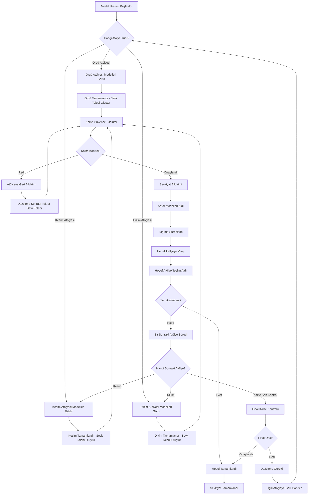

# Prodüksiyon/Sevkiyat Workflow Diagramı

## Ana Akış

## Kullanıcı Rolleri ve Sorumlulukları

### 1. Örgü Firması Personeli
**Sorumluluklar:**
- Kendisine atanmış modelleri görüntüleme
- Örgü işlemini tamamlama
- Kalite kontrolü için sevk talebi oluşturma
- Üretim notları ve detayları ekleme

**Ekran Bölümleri:**
- Atanmış Modeller Listesi
- Sevk Talepleri Geçmişi
- Bildirimler

### 2. Kalite Güvence Personeli
**Sorumluluklar:**
- Gelen tüm sevk taleplerini inceleme
- Kalite kontrolü yapma (Fiziksel muayene)
- Onaylama veya reddetme kararı verme
- Ret durumunda detaylı açıklama ekleme

**Ekran Bölümleri:**
- Bekleyen Kalite Kontrolleri
- Onaylanan Sevkiyatlar
- Reddedilen İşler

### 3. Sevkiyat Şoförü
**Sorumluluklar:**
- Onaylanmış sevkiyatları görüntüleme
- Modelleri teslim alma
- Taşıma sürecini takip etme
- Hedef atölyeye güvenli teslimat

**Ekran Bölümleri:**
- Aktif Sevkiyatlar
- Teslim Edilecek Modeller
- Sevkiyat Geçmişi

### 4. Hedef Atölye Personeli (Kesim/Dikim)
**Sorumluluklar:**
- Gelen sevkiyatları kontrol etme
- Teslim alma onayı verme
- Hasar/eksik durumunu raporlama
- Yeni üretim sürecini başlatma

**Ekran Bölümleri:**
- Gelen Sevkiyatlar
- Teslim Alınan Modeller
- Yeni Üretim Süreçleri

## Bildirim Türleri

### Örgü Firması İçin:
- ✅ Sevk talebi onaylandı
- ❌ Sevk talebi reddedildi
- 📋 Düzeltme talimatları alındı
- 🚚 Model sevkiyata çıktı

### Kalite Güvence İçin:
- 🔍 Yeni kalite kontrolü bekliyor
- ⏰ Bekleyen kontrol süre aşımı
- 📊 Günlük/haftalık kalite raporu

### Şoför İçin:
- 📦 Yeni sevkiyat hazır
- 🎯 Teslimat adresi güncellendi
- ⚠️ Acil sevkiyat talebi

### Hedef Atölye İçin:
- 🚛 Sevkiyat yolda
- 📍 Sevkiyat yaklaştı
- 📝 Teslim alma onayı gerekli

## Durum Takip Sistemi

**Model Durumları:**
1. `atolye_uretemde` - Atölyede üretiliyor
2. `sevk_talebi_olusturuldu` - Sevk talebi oluşturuldu
3. `kalite_kontrolunde` - Kalite kontrolü yapılıyor
4. `kalite_onaylandi` - Kalite kontrolü onaylandı
5. `kalite_reddedildi` - Kalite kontrolü reddedildi
6. `sevkiyat_hazirlaniyor` - Sevkiyat hazırlanıyor
7. `sevkiyatta` - Şoför taşıyor
8. `hedef_atolyede` - Hedef atölyeye teslim edildi
9. `sonraki_asamada` - Sonraki üretim aşamasında
10. `tamamlandi` - Tüm üretim tamamlandı

## Raporlama ve İzleme

**Üretim Raporları:**
- Atölye bazlı üretim hızı
- Kalite ret oranları
- Sevkiyat süreleri
- Genel üretim verimliliği

**Performans Metrikleri:**
- Ortalama kalite kontrol süresi
- Sevkiyat başarı oranı
- Atölye kapasitesi kullanımı
- Model tamamlanma süreleri
